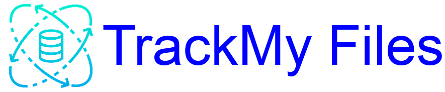

# </img>
[![OS](https://img.shields.io/badge/Windows-black.svg?style=flat-square&logo=data:image/svg+xml;base64,iVBORw0KGgoAAAANSUhEUgAAAC0AAAAtCAMAAAANxBKoAAADAFBMVEVHcEwjHyA/JypXYmcnIyRTRk4kICErJycoJCU1MjMnICAiHyAiHh9rbm83NDS8XzkjHyAlISIjHyFYU1ItKCk5NjdLRkU9OjsoJSYiHiAAtfMMrOMkICElISIkICFEQEEvKywwLS4kICE4NTahX07LZz4Lr+cdkLcmIiMqJicyLzAoIyQuKis/PD2SVDv7aSsnIyRa7fzNZz3zaC4Gsu1MUlUcnsv6dTcjHyAkICEoJCUqJic2MzQdlr8rJiYzMDEkHyAkICEmIiMiHh87OTpFR0kyMDE4NTYqdI41f5kAtvPlaDSzZkcuk7blaDMGsOqcaVS2Z0YEsesdnskfnceyZkYnlrzxaC8jHyAjHyAoIyQiHh8jHh8pJSYoJSZCQEBCPj81MTE/ODgtKSkyLi/3aS7yaC9QS0rYaDnOZz3DaEJEg5goJSZG5f/0aC0slbnjZzTWaDkxjq0Gr+kkmcHeZzYplLkIruYuVWPFYzsyLzA/PD0pJSY1MjMuKyw6ODkwLS92TDwzLzArdIwtZXntaDA6ODh3Szr3aS0VpNUXotHpaDIEsu35aCz7aSwZoc/eaDYSptjXZzkGsOnyaC4AtvXRZzsYotAslbkXotHnaDPcaDfGZ0DzaC62Z0YjHyAejrRwRzg3Li1+TDcxLzEtKitzUUM8OjqYWD58Szd9Tjw7WGMueJI1MzO8Z0Q/U1oKruUrk7b/bi81MjMQp9sAtfIlmL8AuvxPeIYGr+gjmcIjHyAAtPH5aCwhHh//wwCRwwAgHCEhHSD/yACTxwCSxQD8aSwlISH6aSyfew6qTSgNfqUnIyQAtvRWaxFhew4At/YjHR3/xgAoJB/xZy0jICCJaxEEr+l2XRRSZRJWMCMcO0jwuAI0NBx1mgfAkwndXyo+KCEfLzZHVRWLbBExKR5JOxq8UygFndF8PSU6QRmDrgR/ZBNdShj4vgFtjgrQoAdedw8MgqpOPxqVdA8SZoMZSVuJtgJgeg4Pc5cLha8GntIDp94UYHyMQybHVynW//OGAAAAu3RSTlMA4QEM+wPZHfi+KdrxBra99aHlFy+KEVsVz/BOUHGJSNDMqa4CrSK+xe20IYNniPBqAbepfQi3CP24zNR/tGKo13qZgJAouIeKStppTykxnx9lqZGuMZFG6/vzNT768GJSlD7lxtyYILeYhBpLAm87hsVhcDMoavm2s4823sCteqBh5Xxw+aVsyZjV7pLmf3x33e3loz1LwxnKG9N4V0BXvbODt5a7RW9nW3VdYeF5UPBYESrnwXwSFmepJx5SPwAABIpJREFUSMfdlfVfW1cYxg8JISQQCCQECSEBQgoEWtyLS3GXAsHdnerqXd1dmFvnLufm0mSwQBu2AWG4dtW5u5wbYGP9JPsD+v505Xvvfc77vPc5ADxwxeIHOQc6SZS6uVv8bazFwv9ByfxNglwFXK4Rpp6JtQUAUZtJGl5bEqk/Au+r9ZY8sNOExHqGvYL0prBcbQNpxH0cxyFUDA8r5DKcODcFLmzGXqU1+gYVcAqDAbkopLBMCUNpCFXMT0xAfHxm5qtvbkwTqnQIiTQ7amVkqVuRrdKOHy0xNJPgUI+mmL97e051DeIf9fT29F797IZcTVMor3uDQiXuZg+hndEIJGjD8MeuzUn7+j5Q01dR9XwoI+iXjpEAx7cwMIxqD3XcjCC03ObkGLLduE+K6l+6d5E+cUSY0JzNsQD1MRHsFCMdm+eeDhHoGhhLNdJJvuRmaTZIuZTNSaiqKHrYoXx1AYShWmjUsqbLvl0XVQ01e6SeNQela1brIzla6MwuIQWAVNXhyw5S6SkPKaIlTEeXjZrpE6dIKZeSupraGQ5rKpI8pIcrdtg6CwK0vPtYkreDKhuQMtvPnEmNr/asrnrWVh/qqemlDvaihvcs6yZXeV5IqT7YkHBR5ZnavAcpwaGBcV9fn2ru9l0I742Pj/8889MSzaC0+yLd0nik21OtWx9nmmxU/fXnxDxht1wmk+HD96bVzpu5kACLnLqv4YKDtDwe0fuuFDiGPPnExDCaqcFBNKxoqnCZTK6md4YJzQV1vq8BSs2RzCiP8qYd/JAyfT0aIhULk5MQH5udne0fuzWspsUUchkzH0SZ1bHMy8ITrkSbBjkhd2iKyT9+vTN6Hcr73x8aGuqeGpMvuRNkTeGXKniRSmgXqY+minBnw/XfsYGBjwl6qBvV0KfqVdYmuqOfx1VpUIdm0CQaQsMYCTPAZe0AhmoF/YmaPpDsTn5VVMITC+1NbehGUCfCXBAtCFiFaaT3n2ZkdXIBqD1Xwo7lFofv3v8CcidUC43cOfum6J23jr/b6NOZFpvxitU6XeSONprBaHwbtIxire9hWFoGhlmtI9xZq5nO8nIHteSWk4dEGZiVlw+Gxe0qcCx+XAt93EvYcoB7TgQo6cncNh+rtKOxxc5OeoQSdQfx76emvuweWuqgqJ583uo0SEznJnacT+5IP3tyVylyZ9XAwOidb3+YhHD61ndfjPV//fmyO0e59bFvYK1Zo1haViehG9GP/vbLjwsKYk5wuRyFz82baucr1cnWMRrHRStM9iFWqesX6rJhAQ7iK2KNSC1Ev2hC4rjSG1tFlIw4r0QfLM7r+cCHop+iLUJ+zJycHMP1S4/ogE15jL26KNkqqW1t5sHph3ZvNzdyGtGjodA09Y94JJ9NZ+dZ80wsmcvJttVfzIrZ4sYvU9q97Jy7mGxb/Rx5dO9/opRkkW9j6WeKjihszn+TDa3SPyiYc39MWwSHLx0VhkaI7aEpDyVb6DaJQRhVw05AotKXn6MC9xgburcRmsPNYWKN2wUJQSs2DyTKPA9dffC20L8BwsPD6VFAmjYAAAAASUVORK5CYII=)](https://github.com/SNEHASISHROY-125/TrackMyFiles/releases/download/V1.7.1/TrackMyPC_V1.7.1.zip)

TrackMyFiles is a user-friendly desktop application designed to streamline file management. 

## Features

- **Memo Notes**: Attach memo notes to any file on your system.
- **Search**: Use keywords from the memo notes to locate your files.
- **File Management**: Each file is displayed with an 'Open File' and a 'Delete Note' button for easy management.
- **File Opening**: Clicking the 'Open File' button will open the associated file in its default application.

## Screenshots

## Technologies Used

- **KivyMD**: Used for creating a modern and user-friendly interface.
- **SQLite3**: A lightweight database system used for storing and retrieving the memo notes.
- **PyInstaller**: Used to compile the application into a standalone executable.

## Installation

The application is compiled into a standalone executable using PyInstaller, making it easy to install and use on any Windows system.

# Resources Used

This project uses icons and assets from various sources. Here are some of the main sources:

* Some icons provided by [Icons8](https://icons8.com/)
* Additional icons powered by [Iconscout](https://iconscout.com)

A complete list of all icons and assets used, along with their attribution links, can be found in the [Asset Details](https://github.com/SNEHASISHROY-125/TrackMyFiles/blob/develop/asset_details.txt) file.